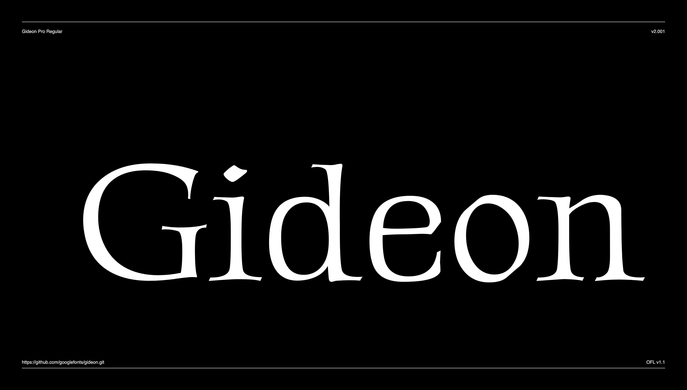

# Gideon Roman

Gideon Roman is a traditional typeface with classic forms. Perfect for uses from invitations, greeting cards and menus, to display advertising.

The upper case letters have a tradition Roman feel that adds warmth and sophistication to text while the legibility allows for larger blocks of copy to be easily read.

Gideon comes with Latin Character sets including Western, Central, and Vietnamese language support.



## Building the Fonts

The font is built using fontmake and gftools post processing script. Tools are all python based, so it must be previously installed.

To install all the Python tools into a virtualenv, do the following:

From terminal:

```

cd your/local/project/directory

#once in the project folder create a virtual environment. 
This step has to be done just once, the first time:

python3 -m venv venv

#activate the virtual environment

source venv/bin/activate

#install the required dependencies

pip install -r requirements.txt

```

Then run the this command:

```
cd sources
gftools builder config.yml
```
